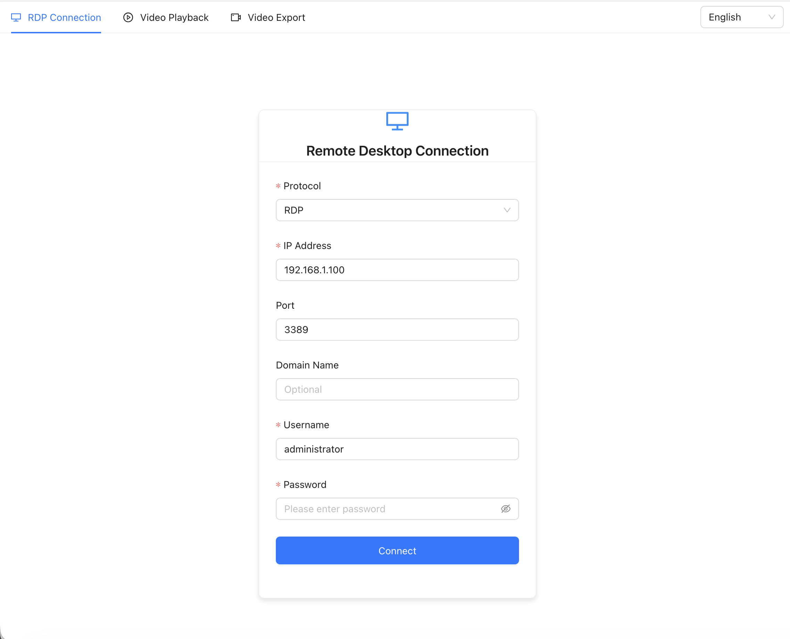
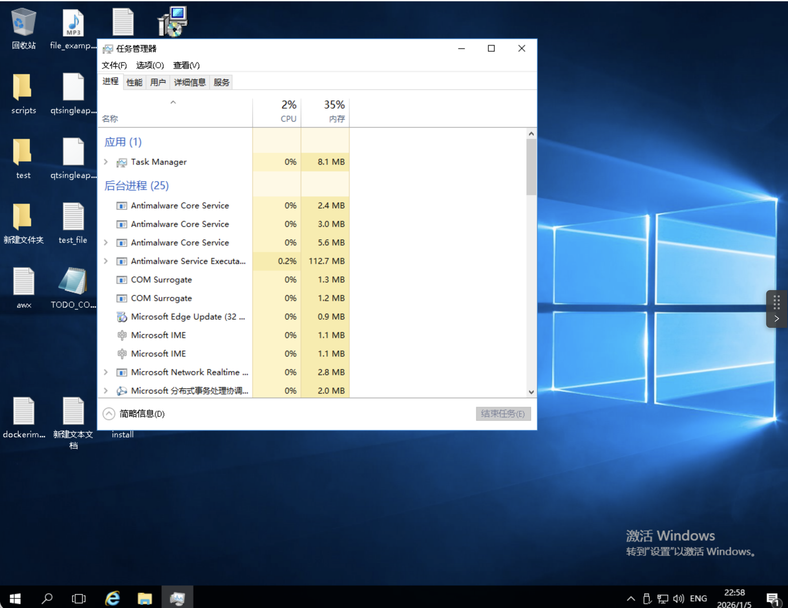
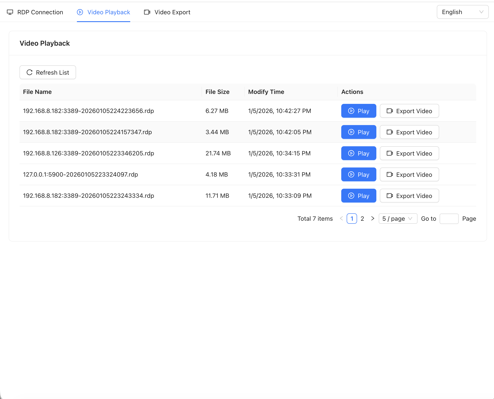
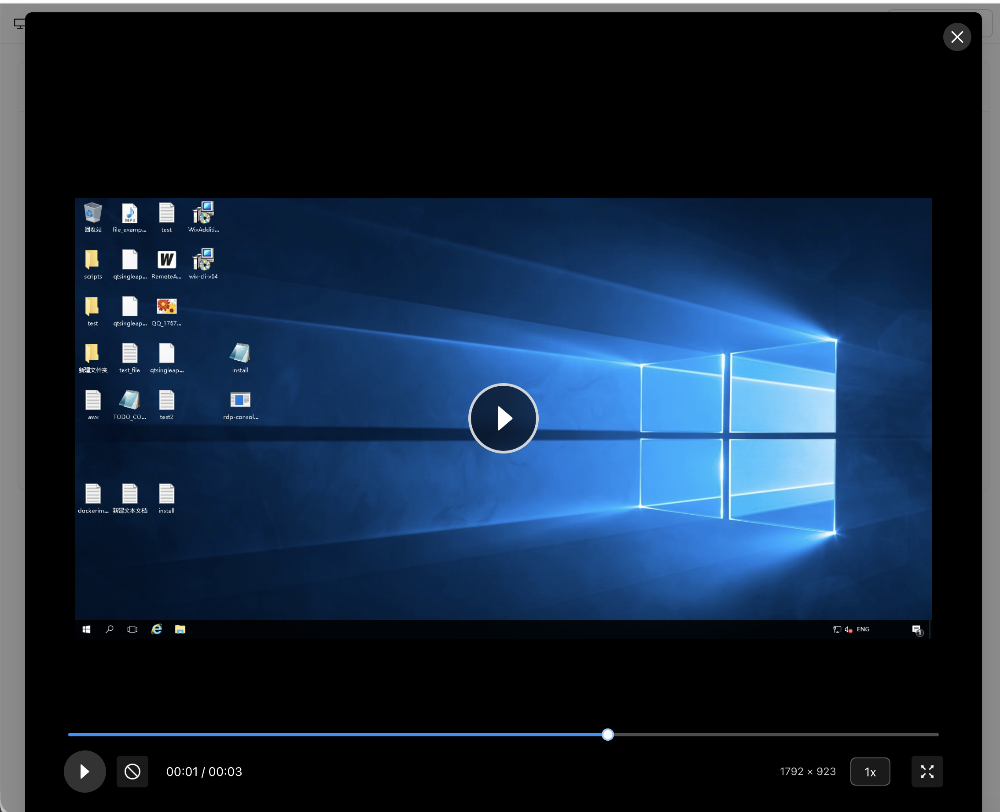
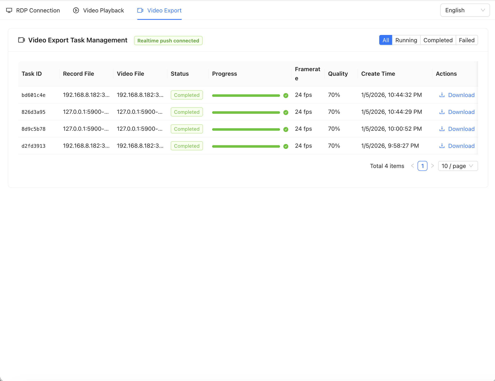

# rdpconsole

# 说明

纯go版本的rdp协议web版本实现，支持windows服务器rdp NLA安全协议支持剪贴板、磁盘映射等虚拟通道功能、支持音频输出、远程应用等高级功能，同时支持vnc协议的远程管理

# 如何使用

Linux下执行./rdp-console-linux-x86-64

Windows下执行./rdp-console-windows-x86-64

MacOS下执行./rdp-console-darwin-x86-64

默认监听的8088端口，在浏览器中输入http://ip:8088即可进入服务器登录界面

# 开启审计功能

Linux下执行./rdp-console-linux-x86-64 -a=true

Windows下执行./rdp-console-windows-x86-64 -a=true

MacOS下执行./rdp-console-darwin-x86-64 -a=true

监控录像放在当前目录audit目录下，截图存放为当前img目录下

默认监听的8088端口，在浏览器中输入http://ip:8088即可进入服务器登录界面

# 局限

目前未实现剪贴板功能及磁盘映射协议


# web版本linux ssh协议登录项目
[https://github.com/jimmy201602/webconsole](https://github.com/jimmy201602/webconsole)

# release
```shell
Nov 24, 2021
新增nla登陆功能
Dec 1, 2023
新增rdp审计
Sep 14, 2024
修正键盘上下左右失灵问题，同时修正审计视频黑边问题
Sep 15, 2024
优化录像审计的性能问题
Jan 5, 2026
支持更完整的RDP协议实现
支持NLA、SSL、标准RDP认证
支持剪贴板、磁盘映射等虚拟通道功能
支持音频输出、远程应用等高级功能
支持完整的RDP会话管理
支持多用户并发连接
支持会话断开通知
```

# 开源计划

暂不开源，如有源码及二次开发需要，可加我QQ号码获得收费技术支持：313484953

# 预览






# 预览视频

https://user-images.githubusercontent.com/17548183/143253513-42d58183-6b41-491d-b85f-bb38127a8947.mp4

# 限制

目前录像功能不流畅